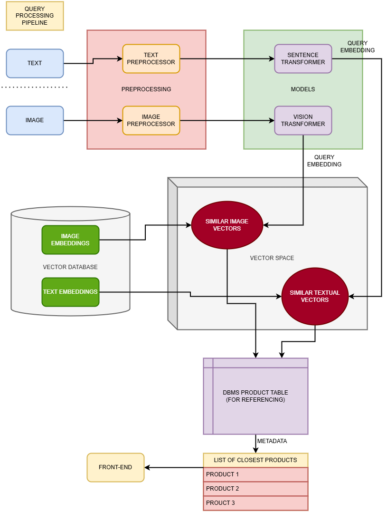
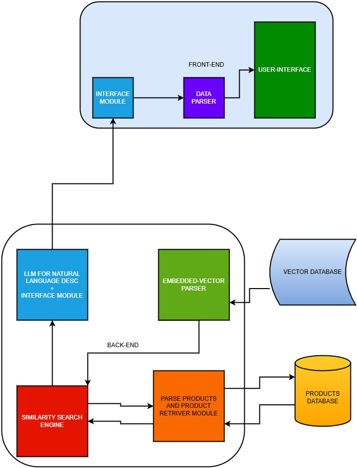

# Semantic-Search-Engine

This is a Sematic Search Engine made for an e-commerce website (like Addidas) that allows users to input texts in a natural language and it outputs recommendations according to the prompts of the user. 

The dataset for the project has been obtained on [Adidas US retail products dataset - dataset by crawlfeeds | data.world](https://data.world/crawlfeeds/adidas-us-retail-products-dataset). The dataset consists of 850 rows of products sold by Addidas retail and their descriptions, category fit and gener specificity.

## Prerequisites

1. `python 3.0` or higher
2. `flask`
3. `pinecone`
4. `langchain`

The other requirements are specified in the requirements.txt file.

## Overview of the project

The working of the project is explained as follows : 

1. The user inputs the text data. (Image functionlity to be added later)
2. This query is then passed through an LLM that then recommends products that are generally suited for the user query
3. These products are then embedded in a vector space with other similar image and text embeddings
4. The embeddings orf the products in the vicinity of the query are obtained using similarity search and thus, the product list and their respective metadata is obtained from the database
5. A results page then dynamically renders thesequery results.

To use and recreate the repository:

1. Clone the repository using `git clone` and navigate into the repository `web_design`
2. Once the repository is cloned onto the local machine, download models for the textual and image processing and generating embeddings. For this, I have used the **clip** model to generate image embeddings and the **multi-qa-mpnet-base-dot-v1** to generate the textual embeddings. I have obtained the aforementioned models on HuggingFace. Once obtained, replace the folders of the models with those obtined to downloading said models in the `webdesign/utils`
3. Now, simply run `python -m app`

## Working of the project

The flow of the project is divided into two parts : 

#### Data Ingestion

This stage involved:

1. Ingestion of data in the form of text and imags
2. Training the embedding models
   1. For the textual data, two kinds of models were used :
      1. Sentence transformers (SBERT) to obtain the dense embeddings
      2. Pinecone also allows hybrid search using sparse embeddings. As such, the BM25 encoder was used to encode sparse embeddings
   2. For image embeddings, CLIP(ViT) wa used.
3. Upserting the vectors in an embeddings space. Pinecone(free tier) was used as a vector database for upserting the obatined embedding vectors and also querying the search space.

#### Inference

This stage involves actually making a working full-stack website. This stage involved : 

1. Front-end :
   1. Involved making a User-friendly UI for input textual and image queries
   2. A data parser to parse the data sent from the backend
   3. An interfacing module to connect to the backend using REST API
2. Back-end:
   1. The backend of the project was made using Flask.
   2. The input from the user was caught at the backend, where it was then passed to an LLM to interpret the natural language response. The LM inference was made by `Groq LLM` that allows for rapid LLM inference and practically illegible delay.
   3. The response so obtained was then run through fine-tuned embedding models to obtain the dense and sparse embeddings of the user query.
   4. A cosine similarity search was performed to obtain the recommendations which are they passed via the interfacing module to the frpont-end to be dynamically rendered.

